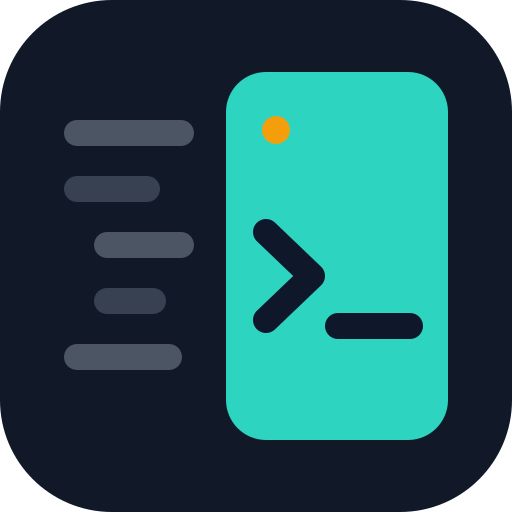

# Perch — VS Code Side Panel for Google Antigravity CLI

> Open Google's **Antigravity CLI** (`agy`) directly inside VS Code — perched on a dedicated **right-side panel**, providing a side-panel experience similar to other AI coding extensions.

> **Disclaimer:** Perch is an independent project and is not affiliated with, sponsored by, or endorsed by Google. Antigravity is a trademark of Google LLC. Perch requires Google's Antigravity CLI (`agy`) to be installed separately.

[](https://marketplace.visualstudio.com/items?itemName=nuwanthapasindu.antigravity-cli)
[](https://marketplace.visualstudio.com/items?itemName=nuwanthapasindu.antigravity-cli)

<p align="center">
  
</p>

---

## Table of Contents

- [Overview](#overview)
- [What's New in v0.0.3](#whats-new-in-v003)
- [Features](#features)
- [Requirements](#requirements)
- [Installation](#installation)
  - [Install from VS Code Marketplace (Easiest)](#install-from-vs-code-marketplace-easiest)
  - [Install from VSIX](#install-from-vsix)
  - [Install from Source](#install-from-source)
- [Building from Source](#building-from-source)
- [Running & Debugging](#running--debugging)
- [Usage](#usage)
- [Configuration](#configuration)
- [Project Structure](#project-structure)
- [Contributing](#contributing)
- [License](#license)

---

## Overview

**Perch** is an independent VS Code extension that seamlessly integrates Google's Antigravity CLI (`agy`) AI coding assistant into your editor. Instead of constantly context-switching to a separate terminal window, `agy` opens as a **right-side editor panel** — keeping your code visible on the left and your AI assistant perched right beside it.

This provides a side-panel experience similar to other AI coding extensions, customized specifically for developers using the Google Antigravity CLI.

---

## What's New in v0.0.3

- **Rebranded to Perch:** Complete brand refresh with a modern split-panel icon and redesigned interface elements.
- **Updated Settings:** Introduced `perch.executable` and `perch.defaultArgs`. Existing user settings under `antigravity.executable` and `antigravity.defaultArgs` continue to work automatically through backward-compatible fallback.
- **Refined Command Palette:** All commands and side-panel views are now grouped under the **Perch** name (e.g., `Perch: Open Terminal`).
- **Drag & Drop Support (v0.0.2):** Drag files directly from VS Code Explorer into the active Perch terminal while holding `Shift` to paste absolute paths.

---

## Features

| Feature | Description |
|---|---|
| **Activity Bar Icon** | Perch icon in the left sidebar — click to open the welcome panel |
| **Right-Side Terminal** | `agy` opens as an editor tab on the right (not the bottom panel) |
| **Top-Right Button** | Perch button in every editor's top-right corner for instant access |
| **Status Bar Item** | `Perch` indicator at the bottom-left — always visible, click to open |
| **Keyboard Shortcut** | `Cmd+Shift+A` (Mac) / `Ctrl+Shift+A` (Windows/Linux) |
| **Command Palette** | Full command palette support for Open / Restart / Stop |
| **Smart Reuse** | Focuses existing terminal instead of opening duplicates |
| **Auto-Close** | Terminal closes automatically when you run `/exit` in `agy` |
| **Configurable** | Set custom executable path and default arguments (`perch.executable`, `perch.defaultArgs`) |

---

## Requirements

Before installing the extension, make sure you have:

- **VS Code** `v1.85.0` or higher
- **Node.js** `v18+` and **npm** (only needed if building from source)
- **Google Antigravity CLI (`agy`)** installed and available in your `PATH`

### Verify `agy` is installed

```bash
agy --version
```

If `agy` is not found, install it following the official Google Antigravity CLI documentation.

---

## Installation

### Install from VS Code Marketplace (Easiest)

The extension is **published on the VS Code Marketplace** — install it in one click:

**[Install Perch on VS Code Marketplace](https://marketplace.visualstudio.com/items?itemName=nuwanthapasindu.antigravity-cli)**

Or search for **`Perch`** in the VS Code Extensions panel (`Cmd+Shift+X`).

---

### Install from VSIX

If you prefer to install manually from a `.vsix` file:

**Install via VS Code UI:**

1. Open VS Code
2. Press `Cmd+Shift+P` (Mac) / `Ctrl+Shift+P` (Windows/Linux)
3. Type `Extensions: Install from VSIX...` and press Enter
4. Select `perch-0.0.3.vsix`

**Or install via terminal:**

```bash
code --install-extension perch-0.0.3.vsix
```

**Reload VS Code:**

```
Cmd+Shift+P → Developer: Reload Window
```

The Perch icon will appear in the Activity Bar.

---

### Install from Source

If you want to build and install the latest version directly from source code:

```bash
# 1. Clone the repository
git clone https://github.com/Nuwanthapasindu/perch-vscode-extension.git
cd perch-vscode-extension

# 2. Install dependencies
npm install

# 3. Compile TypeScript
npm run compile

# 4. Package into a VSIX file
npm run package

# 5. Install the VSIX into VS Code
code --install-extension perch-0.0.3.vsix

# 6. Reload VS Code
# Cmd+Shift+P → Developer: Reload Window
```

---

## Building from Source

### Prerequisites

```bash
# Check Node.js version (v18+ required)
node --version

# Check npm version
npm --version
```

### Step-by-Step Build

**1. Clone the repository**

```bash
git clone https://github.com/Nuwanthapasindu/perch-vscode-extension.git
cd perch-vscode-extension
```

**2. Install dependencies**

```bash
npm install
```

This installs all `devDependencies` including TypeScript, `@types/vscode`, and `@vscode/vsce`.

**3. Compile TypeScript**

```bash
npm run compile
```

This compiles all `.ts` files from `src/` into `out/` using `tsconfig.json`.

Expected output — compiled files in `out/`:
```
out/
├── extension.js
├── statusBarManager.js
├── terminalManager.js
└── welcomeViewProvider.js
```

**4. Package the extension**

```bash
npm run package
```

This runs `vsce package` and produces `perch-0.0.3.vsix`.

> **Note:** The VSIX package contains only compiled `out/` files, `resources/`, `icon.png`, `package.json`, and `README.md`. Source files and `node_modules` are excluded via `.vscodeignore`.

---

## Running & Debugging

The fastest way to test your changes is to use the **Extension Development Host** — a sandboxed VS Code instance that runs your extension live.

### Launch with F5

1. Open the project folder in VS Code:
   ```bash
   code /path/to/perch-vscode-extension
   ```

2. Make sure you have compiled the code at least once:
   ```bash
   npm run compile
   ```

3. Press **`F5`** (or go to `Run → Start Debugging`)

VS Code will:
- Start a TypeScript watch build (`npm run watch`)
- Launch a new **Extension Development Host** window
- Load Perch automatically in that window

### Watch Mode (Auto-recompile)

To automatically recompile on every file save:

```bash
npm run watch
```

While watch mode is running, press `F5` to launch the host. Changes you save will recompile instantly — run `Developer: Reload Window` in the host to pick them up.

---

## Usage

Once installed and reloaded, use any of these methods to open the terminal:

| Method | Action |
|---|---|
| **Activity Bar** | Click the Perch icon in the left sidebar → click **Open Perch Terminal** |
| **Top-Right Button** | Click the Perch icon in the top-right corner of any editor tab |
| **Status Bar** | Click **Perch** at the bottom-left of VS Code |
| **Keyboard Shortcut** | `Cmd+Shift+A` (Mac) / `Ctrl+Shift+A` (Windows/Linux) |
| **Command Palette** | `Cmd+Shift+P` → `Perch: Open Terminal` |

### Other Commands (Command Palette)

```
Perch: Open Terminal     → Opens or focuses the Perch terminal
Perch: Restart Terminal  → Kills and restarts the Perch terminal
Perch: Stop Terminal     → Closes the Perch terminal
```

### Exiting

Type `/exit` inside `agy` — the terminal panel will close automatically.

---

## Configuration

Open VS Code Settings (`Cmd+,`) and search for `perch` to configure:

| Setting | Type | Default | Description |
|---|---|---|---|
| `perch.executable` | `string` | `"agy"` | Path to the Google Antigravity CLI binary |
| `perch.defaultArgs` | `string[]` | `[]` | Arguments passed to `agy` on every launch |

### Backward Compatibility

For existing installations, Perch seamlessly falls back to legacy settings if configured:

| Legacy Setting | Status | Replacement |
|---|---|---|
| `antigravity.executable` | Deprecated | `perch.executable` |
| `antigravity.defaultArgs` | Deprecated | `perch.defaultArgs` |

### Example: Custom executable path

If `agy` is not in your default system `PATH`, set the full path:

```json
// settings.json
{
  "perch.executable": "/Users/yourname/.local/bin/agy",
  "perch.defaultArgs": []
}
```

---

## Project Structure

```
perch-vscode-extension/
│
├── src/                          ← TypeScript source files
│   ├── extension.ts              ← Entry point (activate / deactivate)
│   ├── terminalManager.ts        ← Terminal lifecycle management & config fallback
│   ├── statusBarManager.ts       ← Status bar item (idle / running states)
│   └── welcomeViewProvider.ts    ← Sidebar webview panel HTML
│
├── out/                          ← Compiled JavaScript (auto-generated)
│   ├── extension.js
│   ├── terminalManager.js
│   ├── statusBarManager.js
│   └── welcomeViewProvider.js
│
├── resources/
│   ├── icon.svg                  ← Activity Bar / Command SVG vector icon
│   └── hold-shift-key.gif        ← Drag-and-drop feature demonstration
│
├── .vscode/
│   ├── launch.json               ← F5 debug configuration
│   └── tasks.json                ← TypeScript watch build task
│
├── icon.png                      ← Perch extension icon (Marketplace, Webview, Terminal tab)
├── package.json                  ← Extension manifest (commands, keybindings, menus)
├── tsconfig.json                 ← TypeScript compiler configuration
├── .eslintrc.json                ← ESLint rules
├── .vscodeignore                 ← Files excluded from the VSIX package
├── .gitignore
├── CHANGELOG.md                  ← Release history
├── LICENSE                       ← MIT License
└── README.md
```

---

## Contributing

1. Fork the repository
2. Clone your fork:
   ```bash
   git clone https://github.com/Nuwanthapasindu/perch-vscode-extension.git
   ```
3. Create a feature branch:
   ```bash
   git checkout -b feat/your-feature-name
   ```
4. Make changes, compile, and test with `F5`
5. Commit with a descriptive message:
   ```bash
   git commit -m "feat: describe your change"
   ```
6. Push and open a Pull Request

---

## License

MIT — see [LICENSE](LICENSE) for details.
